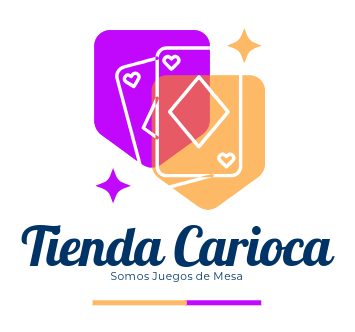

# FULLSTACK II SEMANA 5 CATALOGO JUEGOS DE MESA VERSIÓN ANGULAR

  

  Somos una tienda especializada en juegos de mesa. ¡Bienvenidos a nuestro repositorio!

## Descripción de la Actividad
En esta quinta semana realizarán la actividad formativa individual 4, llamada "Implementando pruebas unitarias". Este encargo consiste en hacer uso de eventos y formularios reactivos, así como implementar pruebas unitarias a la actividad formativa 3, realizada en la semana anterior, mediante la implementación de los Frameworks Jasmine y Karma para validar su correcto funcionamiento.

## Objetivos
1.	Se continuará con el desarrollo de la actividad formativa de la semana 4.
2.	Se deben modificar todos los formularios realizados en HTML a la nueva estructura de formularios reactivos.
3.	Para las validaciones del formulario anterior se debe considerar lo siguiente:
4.	Ninguno de los campos del formulario (exceptuando la dirección de despacho) puede estar vacíos o nulos.
5.	El correo electrónico debe seguir el formato de un email.
6.	Las dos contraseñas deben ser iguales.
7.	La contraseña debe contener al menos un número y al menos una letra en mayúscula.
8.	Hay que considerar que la persona no puede tener menos de 13 años para registrarse en el sitio web.
9.	La dirección de despacho es opcional.
10.	La contraseña debe tener un rango de longitud entre 6 y 18 caracteres.
11.	Deben aparecer dos botones, uno para enviar el formulario y otro para limpiar el formulario.
12.	Se deben implementar 2 pruebas unitarias sobre el desarrollo FrontEnd realizado.

## Nombre de la Tienda
- Tienda Carioca, somos juegos de mesa

## Categorías
- Estrategia
- Familiares
- Party Games
- Cooperativos

## Catálogo

### Estrategia

- Catan
- Risk
- Ticket to Ride
- Splendor

### Familiares

- Monopoly
- Scrabble
- Clue
- Uno

### Party Games

- Taboo
- Charades
- Exploding Kittens

### Cooperativos

- Pandemic
- Flash Point
- Forbidden Island

## Stack Utilizado
- HTML
- Javascript
- Css
- Logo Adobe
- Visual Studio Code
- Extenciones Live Preview Microsoft
- Bootstrap 5.3

## Git y Trello
- Los links relacionados se comparten en AVA

## Conclusiones
El ejercicio cumple satisfactoriamente con los objetivos planteados.